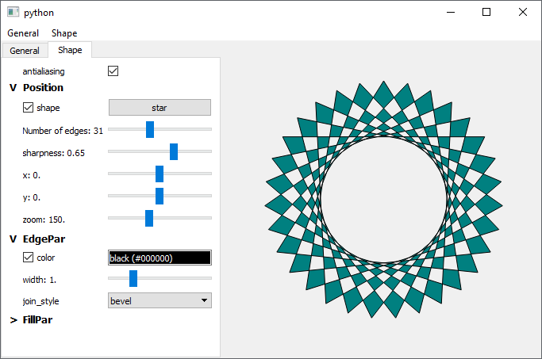

# param_qt
Qt interface for param

- automatic generation of control panels and menus
- controls adapted to each param type; for some of them multiple styles are defined (e.g. ObjectSelector -> dropdown menu or cycling button)
- simple syntax to make the visibility and/or enabling of some parameters depend on the value of other parameters
- sub-panels for nested parameters can be folded or developed
- handling of translation functions for multi-lingual purpose
- Qt interfaces can be build upon either a `pm.Parameterized` instance or a class (however `@depends` does not work on classes, which is actually a `param` bug).

Test it with `test_ParamQt.py`! (you can try both `TEST_INSTANCE = True` or `False` at the top)

